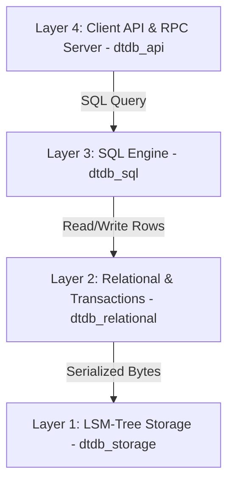

# DuctTapeDB 🛠️

[](https://codecov.io/github/dogacan/dtdb)
[](https://github.com/dogacan/dtdb/actions/workflows/rust.yml)
[](https://deps.rs/repo/github/dogacan/dtdb)

**DuctTapeDB** is a from-scratch relational database written in Rust. It prioritizes clean abstractions, highly readable code, and simplicity over high performance and absolute reliability.

---

## 🏗️ Architecture

DuctTapeDB is organized as a layered, bottom-up architecture. Each layer communicates exclusively with the layer directly beneath it:



### 1. Layer 1: Storage Engine (`dtdb_storage`)

An Log-Structured Merge-tree (LSM-tree) key-value engine handling raw byte persistence.

* **Memtable**: Memory-buffered writes using a standard `BTreeMap`.
* **Write-Ahead Log (WAL)**: Append-only durability log to recover the memtable upon database crash.
* **SSTables**: Block-based, read-only on-disk tables featuring LZ4 compression and a binary-searchable index for fast lookups.
* **Compaction**: Merges and purges redundant writes and tombstones from disk.

### 2. Layer 2: Relational Mapping & Transactions (`dtdb_relational`)

Bridges the gap between raw key-values and structured schemas.

* **Relational Schema**: Columns typed as `Int`, `Float`, `String`, or `Bytes` with primary key support.
* **Row Serialization**: Uses `bincode` to convert tabular rows into serialized bytes stored in Layer 1.
* **Transactions**: Implements buffered, isolated writes (Read-Your-Own-Writes) that can be committed atomically or rolled back completely.
* **Table & Index Statistics**: Tracks row count, index entry count, and key distribution details. Statistics are cached and persisted in `statistics.bin` subdirectories.
* **Background Statistics Collector**: Spawns an asynchronous background thread configured via `analyze_frequency_ms` to periodically refresh stats under `ReadUncommitted` isolation.

### 3. Layer 3: SQL Engine (`dtdb_sql`)

Parses, plans, optimizes, and executes queries.

* **Dialect Parsing**: Integrates `sqlparser` to compile AST statements, including the `ANALYZE TABLE` command.
* **Logical Planner**: Converts ASTs into a relational algebra `LogicalPlan` tree.
* **Cost-Based Optimizer (CBO)**: Replaces rule-based heuristics with a cost-based model that uses statistics to estimate physical scan costs, select the best secondary index paths, and prune locality groups.
* **Volcano Execution Pipeline**: Compiles logical nodes into a streaming physical iterator pipeline (`next()` interface), executing joins via `PhysicalSortMergeJoin` and groupings via `PhysicalHashAggregate`, both of which spill to disk under memory pressure.
* **SQL Dialect**: For more details on the dialect, data types, expressions, operators, and functions supported, see the [SQL Support Reference](docs/sql_support.md).

### 4. Layer 4: Client API & RPC Server (`dtdb_api`)

Exposes database resources over a client API supporting both embedded (in-process) and client-server (gRPC) configurations.

* **Protobuf API**: Defines database creation/deletion, streaming query execution, and bidirectional streaming transaction endpoints.
* **gRPC Server**: Restores existing databases on boot, implements stateful multi-statement transactions using a streaming RPC, and streams query rows back.
* **Client Library**: Two mirror-image Rust clients — the synchronous `InProcessClient` for embedded execution and the async `RemoteClient` for gRPC — sharing the same query types and an explicit transaction closure API (`run_in_transaction`). See the [In-Process API Guide](docs/in_process_api.md) for embedded usage.

---

## 📚 Documentation

* [SQL Support Reference](docs/sql_support.md) — Supported statements, data types, expressions, and functions.
* [In-Process API Guide](docs/in_process_api.md) — Embedding DuctTapeDB with the synchronous `InProcessClient`, plus full-text search with custom Rust tokenizers and the async `RemoteClient` counterpart.
* [Configuration Reference](docs/configuration.md) — `DatabaseOptions`, per-locality-group overrides, transaction isolation levels, and other knobs.
* [C++ & Swift Bindings Guide](docs/bindings.md) — Cross-language FFI for embedding DuctTapeDB in non-Rust applications.

---

## 📂 Project Structure

```
.
├── docs/               # Architecture designs and SQL documentation
├── dtdb_storage/       # Layer 1: LSM-tree Storage Engine (memtable, WAL, SSTable, compaction)
│   └── src/bin/        # dtdb_storage_cli: Interactive key-value CLI
├── dtdb_relational/    # Layer 2: Relational Schema metadata & Transaction boundaries
├── dtdb_sql/           # Layer 3: SQL Query Planner, Optimizer, and Volcano execution
│   └── src/bin/        # dtdb_sql_cli: Interactive multi-line SQL shell
├── dtdb_bindings/      # C++ and Swift FFI bindings (cxx bridge, dtdb::Client wrapper)
├── dtdb_api/           # Layer 4: Client API (In-Process/Remote), gRPC Server, and SQL CLI
│   └── src/bin/        # dtdb_server (gRPC daemon) and dtdb_client_cli (SQL prompt)
└── dtdb_fuzz/          # Property & fuzz targets for WAL/SSTable corruption and concurrent txns
```

---

## 🚀 Getting Started

### Prerequisites

Make sure you have [Rust](https://www.rust-lang.org/) installed (cargo 1.70+ recommended).

### Running Tests

Execute the entire test suite across all workspace crates:

```bash
cargo test
```

### Running the Fuzz Suite

The `dtdb_fuzz` crate exercises durability and concurrency surfaces with
random inputs — WAL recovery, SSTable parsing, concurrent transactions, and
end-to-end SQL operation sequences across `flush_db` + reopen. Targets are
`#[ignore]`d so `cargo test` skips them. Run them via:

```bash
./scripts/run_fuzz.sh                       # default PR-time budget (~50s)
BOLERO_FUZZ_ITERATIONS=50000 PROPTEST_CASES=4096 ./scripts/run_fuzz.sh  # long run
```

CI runs the script on every push/PR with the short budget and on the daily
cron with the long budget.

### Running the Remote gRPC Server & Client

1. Launch the server by specifying a directory where all database folders will be managed:

   ```bash
   cargo run --bin dtdb_server -- ./data
   ```

2. Start the interactive remote client query shell:

   ```bash
   cargo run --bin dtdb_client_cli
   ```

3. Inside the client prompt, select, create, or query databases:

   ```sql
   create database mydb;
   use mydb;
   CREATE TABLE users (id INT PRIMARY KEY, name VARCHAR, score FLOAT);
   INSERT INTO users (id, name, score) VALUES (1, "Alice", 95.5);
   SELECT * FROM users;
   ```

### Running the local SQL CLI

Launch the terminal SQL shell on a single database directory directly:

```bash
cargo run --bin dtdb_sql_cli -- ./mydb
```

Once inside the SQL shell, you can run multi-line queries ending with a semicolon `;`:

```sql
-- Create table
CREATE TABLE users (
  id INT PRIMARY KEY,
  name VARCHAR,
  score FLOAT
);

-- Insert rows (supports both single '...' and double "..." quotes)
INSERT INTO users (id, name, score) VALUES 
  (1, "Alice", 95.5),
  (2, "Bob", 82.0),
  (3, "Charlie", 87.5);

-- Standard queries
SELECT name FROM users WHERE score > 85.0 ORDER BY score DESC;

-- Analyze table to generate statistics for CBO
ANALYZE TABLE users;

-- View cost-based execution plan
EXPLAIN SELECT name FROM users WHERE id >= 1 AND id <= 2;

-- Quit CLI
exit
```

### Using the Rust Client Library

You can embed DuctTapeDB directly into your Rust application with the synchronous `InProcessClient`, or run a remote `dtdb_server` and connect to it over gRPC with the async `RemoteClient`. The two clients share the same query types and transaction-closure API, so porting between them is mechanical (add/remove `.await`, swap the constructor).

Add `dtdb_api` as a dependency in your `Cargo.toml`. The embedded client below is fully synchronous — no async runtime required:

```rust
use dtdb_api::in_process::InProcessClient;
use dtdb_api::sql_query;
use dtdb_storage::CompressionType;

fn main() -> Result<(), Box<dyn std::error::Error>> {
    // 1. Open (or create) a data directory and a logical database inside it.
    let client = InProcessClient::open("./data")?;
    client.create_db("mydb", CompressionType::Lz4)?;

    // 2. Run single statements (DDL/writes auto-commit before the call returns).
    client.execute_query("mydb", sql_query!(
        "CREATE TABLE users (id INT PRIMARY KEY, name VARCHAR);"
    ))?;

    // 3. Run multiple statements atomically in a transaction using parameterized
    //    queries. Commits on Ok(_), rolls back on Err(_).
    client.run_in_transaction("mydb", |tx| {
        tx.execute_query(
            sql_query!("INSERT INTO users (id, name) VALUES (@id, @name);")
                .bind("id", 1i64)
                .bind("name", "Alice"),
        )?;
        tx.execute_query(
            sql_query!("INSERT INTO users (id, name) VALUES (@id, @name);")
                .bind("id", 2i64)
                .bind("name", "Bob"),
        )?;
        Ok(())
    })?;

    // 4. Read results back — the query result is an iterator of rows.
    let result = client.execute_query("mydb", sql_query!("SELECT id, name FROM users;"))?;
    for row in result {
        let row = row?;
        println!("{:?} {:?}", row.get_by_index(0), row.get_by_index(1));
    }

    Ok(())
}
```

The remote client mirrors this surface over gRPC; every method is `async` and `run_in_transaction` takes an `async move` closure. See the [In-Process API Guide](docs/in_process_api.md) for both clients in detail.

### C++ & Swift Bindings

DuctTapeDB provides FFI bindings in the `dtdb_bindings` crate, allowing you to embed the database or connect to a gRPC server from C++ and Swift natively.

It exposes a clean, synchronous client wrapper (`dtdb::Client`) featuring an exception-safe counterpart to `run_in_transaction`. For a complete guide on how to build, link, and use the C++ and Swift API, see the [C++ & Swift Bindings Guide](docs/bindings.md).

---

## 🛠️ Diagnostics & Explain Plans

Using `EXPLAIN <query>;` displays the query transformation timeline from planning to execution:

* **Logical Plan**: The raw planned relational algebra tree.
* **Optimized Plan**: Pushes filters below projections and performs cost-based scan path selection (Full scan vs. PK scan vs. Secondary Index scans).
* **Physical Plan**: The Volcano physical execution iterator pipeline.
* **Physical Block Reads Diagnostics**: Tracks cache-miss block reads from disk via `dtdb_storage::PHYSICAL_BLOCKS_READ` to empirically measure physical I/O efficiency.

---

## 🌟 Features

* **Layered, Modular Architecture**: Clean, bottom-up separation between storage (`dtdb_storage`), relation/transaction mapping (`dtdb_relational`), SQL parsing and Volcano execution (`dtdb_sql`), and embedded or gRPC APIs (`dtdb_api`).
* **LSM-Tree Storage Engine**: Features memtables with write-ahead logs (WAL) for durability, block-based SSTables with LZ4 compression, binary-searchable indices, and automatic background compaction.
* **Snapshot Isolation (SI) Transactions**: Supports atomic, isolated transactions using Optimistic Concurrency Control (OCC) validating read-write, write-write, and phantom conflicts at commit time.
* **Rich SQL Support**: Supports DDL (`CREATE`/`DROP` tables and indexes) and DML (`SELECT`, `INSERT`, `UPDATE`, `DELETE`). Features joins (inner and left outer), grouping/aggregation, sorting, conditional expressions (`CASE WHEN`), scalar functions (`SUBSTR`, `LENGTH`, `COALESCE`), and pattern matching (`LIKE`, optimized into a bounded index range scan for prefix patterns and a trigram-index intersection for substring patterns).
* **Cost-Based Query Optimizer (CBO)**: Evaluates scan costs using real-time database statistics (cardinality, size, and locality group division) to select the optimal index scan path and prune unneeded locality groups.
* **SQL ANALYZE & Background Collector**: Supports the `ANALYZE TABLE <name>` SQL command to manually compute statistics, and features a background daemon thread to automatically refresh them periodically without blocking concurrent transactions.
* **Locality Groups (Column Partitioning)**: Allows columns of a table to be physically partitioned and stored in separate LSM-tree subdirectories, optimizing read I/O via query column pruning.
* **Flexible Deployment Modes**: Supports both in-process embedded execution and client-server execution over gRPC using a unified client library.
* **Native Cross-Language Bindings**: Provides FFI bindings in the `dtdb_bindings` crate, allowing the database to be embedded directly into non‑Rust ecosystems.
* **Full-Text Search**: Supports `MATCH ... AGAINST` syntax with token, boolean, and phrase queries via an inverted secondary index, with pluggable custom Rust tokenizers (the built-in `simple` and `trigram` tokenizers plus anything implementing the `Tokenizer` trait). A `trigram` full-text index additionally accelerates substring `LIKE '%…%'` queries via posting-list intersection plus an exact recheck.
* **Fuzz & Property Testing**: A dedicated `dtdb_fuzz` crate runs random-input targets against WAL recovery, SSTable parsing, concurrent transactions, and end-to-end SQL durability (flush + reopen). Wired into CI with a small budget per PR and a larger budget on the nightly cron.

---

## ⚠️ Caveats & Constraints

* **No DDL in Transactions**: Data Definition Language (DDL) statements (such as `CREATE TABLE`, `DROP TABLE`, `CREATE INDEX`, and `DROP INDEX`) are strictly prohibited inside transactions. They must be executed as standalone, auto-committed statements.
* **Bounded-Memory Sorts & Aggregations**: Ordering (`ORDER BY`), grouped aggregation (`GROUP BY`), `DISTINCT`, set operations (`UNION`/`INTERSECT`/`EXCEPT`), and equi-joins all run under a configurable per-operator memory budget (`memory_budget`, default 8 MB). When an operator's working set exceeds the budget it spills sorted runs to disk (`_tmp/`, auto-cleaned) and finishes via external merge sort / sorted-merge, so these operators do not OOM on large inputs. Two caveats remain: a single aggregation group's accumulators and a single join key-group's matching rows are still buffered in RAM, so pathological skew (one enormous group or key) can still grow unbounded.
* **Equality-Only Sort-Merge Joins**: Join operations are limited to equality conditions (`ON t1.id = t2.user_id`) executed using a bounded-memory sort-merge join (both inputs are externally sorted on the join key, then merged). Non-equality joins, right/full outer joins, and parallel join execution are not supported.
