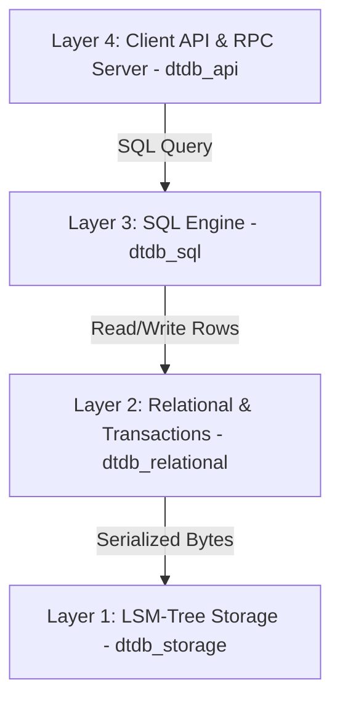

# DuctTapeDB 🛠️

**DuctTapeDB** is a from-scratch relational database written in Rust. It prioritizes clean abstractions, highly readable code, and simplicity over high performance and absolute reliability.

---

## 🏗️ Architecture

DuctTapeDB is organized as a layered, bottom-up architecture. Each layer communicates exclusively with the layer directly beneath it:



### 1. Layer 1: Storage Engine (`dtdb_storage`)

An Log-Structured Merge-tree (LSM-tree) key-value engine handling raw byte persistence.

* **Memtable**: Memory-buffered writes using a standard `BTreeMap`.
* **Write-Ahead Log (WAL)**: Append-only durability log to recover the memtable upon database crash.
* **SSTables**: Block-based, read-only on-disk tables featuring LZ4 compression and a binary-searchable index for fast lookups.
* **Compaction**: Merges and purges redundant writes and tombstones from disk.

### 2. Layer 2: Relational Mapping & Transactions (`dtdb_relational`)

Bridges the gap between raw key-values and structured schemas.

* **Relational Schema**: Columns typed as `Int`, `Float`, `String`, or `Bytes` with primary key support.
* **Row Serialization**: Uses `bincode` to convert tabular rows into serialized bytes stored in Layer 1.
* **Transactions**: Implements buffered, isolated writes (Read-Your-Own-Writes) that can be committed atomically or rolled back completely.

### 3. Layer 3: SQL Engine (`dtdb_sql`)

Parses, plans, optimizes, and executes queries.

* **Dialect Parsing**: Integrates `sqlparser` to compile queries into SQL AST statements.
* **Logical Planner**: Converts ASTs into a relational algebra `LogicalPlan` tree.
* **Optimizer**: Optimizes plans using rules like **Filter Pushdown** and the **Primary Key Range Scanner** (converting filters like `id >= 10 AND id <= 20` into optimized storage scan bounds).
* **Volcano Execution Pipeline**: Compiles logical nodes into a streaming physical iterator pipeline (`next()` interface), executing joins via `PhysicalHashJoin` and groupings via `PhysicalHashAggregate`.
* **SQL Dialect**: For more details on the dialect, data types, expressions, operators, and functions supported, see the [SQL Support Reference](docs/sql_support.md).

### 4. Layer 4: Client API & RPC Server (`dtdb_api`)

Exposes database resources over a client API supporting both embedded (in-process) and client-server (gRPC) configurations.

* **Protobuf API**: Defines database creation/deletion, streaming query execution, and bidirectional streaming transaction endpoints.
* **gRPC Server**: Restores existing databases on boot, implements stateful multi-statement transactions using a streaming RPC, and streams query rows back.
* **Client Library**: A unified Rust client library (`DuctTapeDbClient`) that supports both in-process and remote gRPC execution, featuring an explicit transaction closure API (`run_in_transaction`).

---

## 📂 Project Structure

```
.
├── docs/               # Architecture designs and SQL documentation
├── dtdb_storage/       # Layer 1: LSM-tree Storage Engine (memtable, WAL, SSTable, compaction)
│   └── src/bin/        # dtdb_storage_cli: Interactive key-value CLI
├── dtdb_relational/    # Layer 2: Relational Schema metadata & Transaction boundaries
├── dtdb_sql/           # Layer 3: SQL Query Planner, Optimizer, and Volcano execution
│   └── src/bin/        # dtdb_sql_cli: Interactive multi-line SQL shell
├── dtdb_bindings/      # C++ and Swift FFI bindings (cxx bridge, dtdb::Client wrapper)
└── dtdb_api/           # Layer 4: Client API (In-Process/Remote), gRPC Server, and SQL CLI
    └── src/bin/        # dtdb_server (gRPC daemon) and dtdb_client_cli (SQL prompt)
```

---

## 🚀 Getting Started

### Prerequisites

Make sure you have [Rust](https://www.rust-lang.org/) installed (cargo 1.70+ recommended).

### Running Tests

Execute the entire test suite across all workspace crates:

```bash
cargo test
```

### Running the Remote gRPC Server & Client

1. Launch the server by specifying a directory where all database folders will be managed:

   ```bash
   cargo run --bin dtdb_server -- ./data
   ```

2. Start the interactive remote client query shell:

   ```bash
   cargo run --bin dtdb_client_cli
   ```

3. Inside the client prompt, select, create, or query databases:

   ```sql
   create database mydb;
   use mydb;
   CREATE TABLE users (id INT PRIMARY KEY, name VARCHAR, score FLOAT);
   INSERT INTO users (id, name, score) VALUES (1, "Alice", 95.5);
   SELECT * FROM users;
   ```

### Running the local SQL CLI

Launch the terminal SQL shell on a single database directory directly:

```bash
cargo run --bin dtdb_sql_cli -- ./mydb
```

Once inside the SQL shell, you can run multi-line queries ending with a semicolon `;`:

```sql
-- Create table
CREATE TABLE users (
  id INT PRIMARY KEY,
  name VARCHAR,
  score FLOAT
);

-- Insert rows (supports both single '...' and double "..." quotes)
INSERT INTO users (id, name, score) VALUES 
  (1, "Alice", 95.5),
  (2, "Bob", 82.0),
  (3, "Charlie", 87.5);

-- Standard queries
SELECT name FROM users WHERE score > 85.0 ORDER BY score DESC;

-- View execution plan
EXPLAIN SELECT name FROM users WHERE id >= 1 AND id <= 2;

-- Quit CLI
exit
```

### Using the Rust Client Library

You can embed DuctTapeDB directly into your Rust application (in-process mode) or run a remote `dtdb_server` and connect to it over gRPC (remote mode) using the exact same API interface.

Add `dtdb_api` as a dependency in your `Cargo.toml`. You'll also need `tokio` (with async runtime support) and `futures-util` (for stream processing):

```rust
use dtdb_api::client::DuctTapeDbClient;
use dtdb_api::sql_query;
use dtdb_storage::CompressionType;
use futures_util::StreamExt;

#[tokio::main]
async fn main() -> Result<(), Box<dyn std::error::Error>> {
    // 1. Initialize the client (In-Process mode)
    let mut client = DuctTapeDbClient::in_process("./data")?;

    // Or connect to a remote server over gRPC (Remote mode):
    // let mut client = DuctTapeDbClient::connect("http://127.0.0.1:50051").await?;

    // 2. Create a database
    client.create_db("mydb", CompressionType::Uncompressed).await?;

    // 3. Execute queries (streams result rows)
    let mut stream = client
        .execute_query("mydb", sql_query!("CREATE TABLE users (id INT PRIMARY KEY, name VARCHAR);"))
        .await?;
    while let Some(resp) = stream.next().await {
        println!("{:?}", resp?);
    }

    // 4. Run multiple statements atomically in a transaction using parameterized queries
    client.run_in_transaction("mydb", |tx| async move {
        tx.execute_query(
            sql_query!("INSERT INTO users (id, name) VALUES (@id, @name);")
                .bind("id", 1i64)
                .bind("name", "Alice")
        ).await?;
        tx.execute_query(
            sql_query!("INSERT INTO users (id, name) VALUES (@id, @name);")
                .bind("id", 2i64)
                .bind("name", "Bob")
        ).await?;
        Ok(())
    }).await?;

    Ok(())
}
```

### C++ & Swift Bindings

DuctTapeDB provides FFI bindings in the `dtdb_bindings` crate, allowing you to embed the database or connect to a gRPC server from C++ and Swift natively.

It exposes a clean, synchronous client wrapper (`dtdb::Client`) featuring an exception-safe counterpart to `run_in_transaction`. For a complete guide on how to build, link, and use the C++ and Swift API, see the [C++ & Swift Bindings Guide](docs/bindings.md).

---

## 🛠️ Diagnostics & Explain Plans

Using `EXPLAIN <query>;` displays the query transformation timeline from planning to execution:

* **Logical Plan**: The raw planned relational algebra tree.
* **Optimized Plan**: Pushes filters below projections and reduces scan bounds using the primary key index.
* **Physical Plan**: The Volcano physical execution iterator pipeline.

---

## 📚 Design Decisions

* **Optimistic Concurrency Control (OCC)**: Transactions execute concurrently on top of a multi-threaded engine, using an OCC validation phase at commit time (checking read-write, write-write, and phantom conflicts) to guarantee isolation without coarse-grained locking.
* **Snapshot Isolation**: DuctTableDB only implements snapshot isolation. SI is a well-understood, widely-deployed isolation level (used by PostgreSQL's default READ COMMITTED + REPEATABLE READ modes, Oracle, MySQL InnoDB). It is weaker than SERIALIZABLE but stronger than READ COMMITTED. Full SERIALIZABLE transactions are not supported for now.
* **In-Memory Sorts**: Sorting and aggregations collect row lists in-memory rather than spilling sorted runs to temporary storage.
* **Hash Joins**: Equality joins are performed via building temporary hash tables of the left stream and probing them from the right stream.
* **Single-Statement Query Limitation**: Standard query execution (`execute()`) strictly rejects inputs containing multiple semicolon-separated statements. To run multiple queries atomically, users are required to use the explicit transaction interface (`run_in_transaction` or the gRPC transaction stream), ensuring transaction boundaries are clear and handled safely.
* **Locality Groups & Column Storage**: Supports grouping table columns into separate physical locality groups stored in independent LSM-tree subdirectories. To guarantee 100% correct transactional updates without complex partial-row merges or concurrency anomalies, the database reads all columns during `UPDATE` operations while optimizing read paths (`SELECT` queries) using query-level column pruning to read only the needed locality groups.
