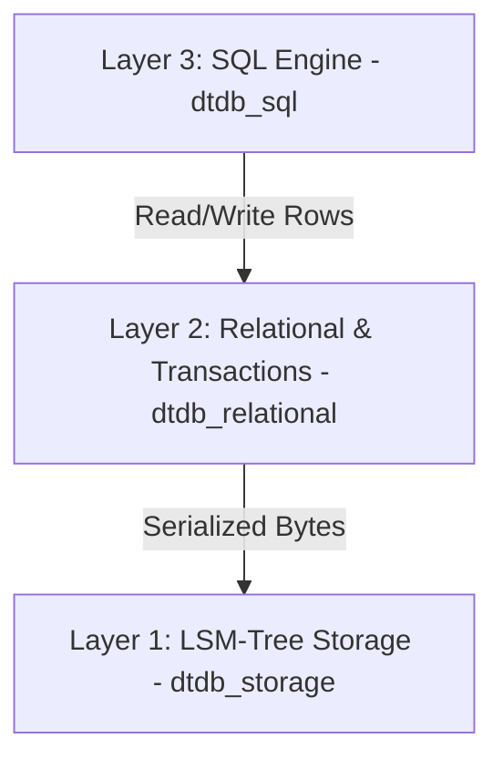

# DuctTapeDB 🛠️

**DuctTapeDB** is an educational, from-scratch relational database written in Rust. It prioritizes clean abstractions, highly readable code, and simplicity over high performance and absolute reliability, making it the perfect learning sandbox for database internals.

---

## 🏗️ Architecture

DuctTapeDB is organized as a layered, bottom-up architecture. Each layer communicates exclusively with the layer directly beneath it:



### 1. Layer 1: Storage Engine (`dtdb_storage`)
An Log-Structured Merge-tree (LSM-tree) key-value engine handling raw byte persistence.
* **Memtable**: Memory-buffered writes using a standard `BTreeMap`.
* **Write-Ahead Log (WAL)**: Append-only durability log to recover the memtable upon database crash.
* **SSTables**: Block-based, read-only on-disk tables featuring LZ4 compression and a binary-searchable index for fast lookups.
* **Compaction**: Merges and purges redundant writes and tombstones from disk.

### 2. Layer 2: Relational Mapping & Transactions (`dtdb_relational`)
Bridges the gap between raw key-values and structured schemas.
* **Relational Schema**: Columns typed as `Int`, `Float`, `String`, or `Bytes` with primary key support.
* **Row Serialization**: Uses `bincode` to convert tabular rows into serialized bytes stored in Layer 1.
* **Transactions**: Implements buffered, isolated writes (Read-Your-Own-Writes) that can be committed atomically or rolled back completely.

### 3. Layer 3: SQL Engine (`dtdb_sql`)
Parses, plans, optimizes, and executes queries.
* **Dialect Parsing**: Integrates `sqlparser` to compile queries into SQL AST statements.
* **Logical Planner**: Converts ASTs into a relational algebra `LogicalPlan` tree.
* **Optimizer**: Optimizes plans using rules like **Filter Pushdown** and the **Primary Key Range Scanner** (converting filters like `id >= 10 AND id <= 20` into optimized storage scan bounds).
* **Volcano Execution Pipeline**: Compiles logical nodes into a streaming physical iterator pipeline (`next()` interface), executing joins via `PhysicalHashJoin` and groupings via `PhysicalHashAggregate`.

---

## 📂 Project Structure

```
.
├── dtdb_storage/       # Layer 1: LSM-tree Storage Engine (memtable, WAL, SSTable, compaction)
│   └── src/bin/        # dtdb_storage_cli: Interactive key-value CLI
├── dtdb_relational/    # Layer 2: Relational Schema metadata & Transaction boundaries
└── dtdb_sql/           # Layer 3: SQL Query Planner, Optimizer, and Volcano execution
    └── src/bin/        # dtdb_sql_cli: Interactive multi-line SQL shell
```

---

## 🚀 Getting Started

### Prerequisites
Make sure you have [Rust](https://www.rust-lang.org/) installed (cargo 1.70+ recommended).

### Running Tests
Execute the entire test suite across all workspace crates:
```bash
cargo test
```

### Running the interactive SQL CLI
Launch the terminal SQL shell by specifying a database directory (it will be created if it does not exist):
```bash
cargo run --bin dtdb_sql_cli -- ./mydb
```

Once inside the SQL shell, you can run multi-line queries ending with a semicolon `;`:

```sql
-- Create table
CREATE TABLE users (
  id INT PRIMARY KEY,
  name VARCHAR,
  score FLOAT
);

-- Insert rows (supports both single '...' and double "..." quotes)
INSERT INTO users (id, name, score) VALUES 
  (1, "Alice", 95.5),
  (2, "Bob", 82.0),
  (3, "Charlie", 87.5);

-- Standard queries
SELECT name FROM users WHERE score > 85.0 ORDER BY score DESC;

-- View execution plan
EXPLAIN SELECT name FROM users WHERE id >= 1 AND id <= 2;

-- Quit CLI
exit
```

---

## 🛠️ Diagnostics & Explain Plans

Using `EXPLAIN <query>;` displays the query transformation timeline from planning to execution:
* **Logical Plan**: The raw planned relational algebra tree.
* **Optimized Plan**: Pushes filters below projections and reduces scan bounds using the primary key index.
* **Physical Plan**: The Volcano physical execution iterator pipeline.

---

## 📚 Educational Design Decisions
To keep the engine accessible and highly instructional, several compromises were made:
* **Single-Threaded Execution**: Execution is serialized via transaction locks to prevent concurrency bugs from obscuring relational concepts.
* **In-Memory Sorts**: Sorting and aggregations collect row lists in-memory rather than spilling sorted runs to temporary storage.
* **Hash Joins**: Equality joins are performed via building temporary hash tables of the left stream and probing them from the right stream.
