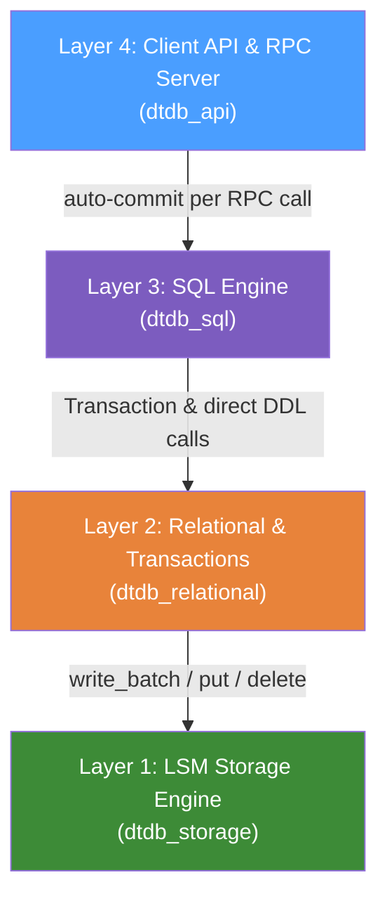
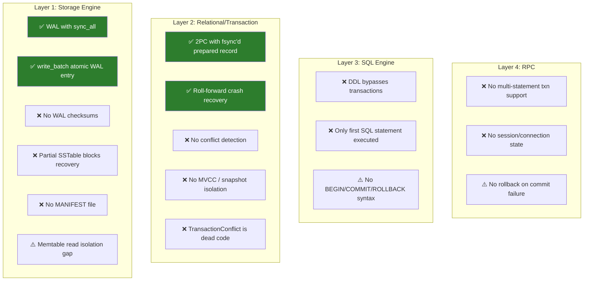

# DuctTapeDB — ACID Compliance Analysis

## Executive Summary

DuctTapeDB has a **surprisingly solid foundation** for an educational database — particularly its 2-phase commit protocol with fsync'd transaction log and WAL-level durability. However, significant gaps remain in **isolation** (no MVCC/conflict detection), **DDL atomicity** (schema operations bypass transactions), and **crash resilience** (partial SSTables can prevent recovery). 

| Property | Grade | Summary |
|----------|-------|---------|
| **Atomicity** | ⚠️ B- | 2PC log for DML is good, but DDL is non-transactional and crash-mid-compaction is unsafe |
| **Consistency** | ⚠️ C+ | Schema/type validation exists, but no unique-key enforcement (upsert semantics), no FK/CHECK constraints |
| **Isolation** | ❌ D | ~READ COMMITTED at best. No MVCC, no snapshot isolation, no conflict detection. Lost updates possible |
| **Durability** | ✅ A- | fsync on WAL and transaction log. Roll-forward recovery works. Missing checksums is the main gap |

---

## Architecture Recap



---

## 1. Atomicity

> *"All operations in a transaction succeed, or they all fail — no partial results."*

### ✅ What Works

**2-Phase Commit Protocol** — The transaction layer implements a write-ahead 2PC:

1. Buffer all writes in-memory (`write_buffer: Mutex<HashMap<...>>`)
2. Write `TransactionRecord::Prepared { tx_id, mutations }` to `transactions.log` with **`file.sync_all()`** ([database.rs:254](file:///Users/dogacan/projects/dtdb/dtdb_relational/src/database.rs#L254))
3. Apply mutations to per-table storage engines via `write_batch()` ([transaction.rs:226-229](file:///Users/dogacan/projects/dtdb/dtdb_relational/src/transaction.rs#L226-L229))
4. Write `TransactionRecord::Committed { tx_id }` record

**Crash recovery rolls forward** — On startup, [database.rs:281-335](file:///Users/dogacan/projects/dtdb/dtdb_relational/src/database.rs#L281-L335) finds `Prepared` records without matching `Committed` and replays the mutations. This means once the `Prepared` record is fsync'd, the transaction **will** be applied — even across crashes.

**Rollback is trivially safe** — [transaction.rs:239-243](file:///Users/dogacan/projects/dtdb/dtdb_relational/src/transaction.rs#L239-L243) simply clears the in-memory buffer. No undo log needed.

**Batch WAL writes** — `write_batch()` at the storage layer writes the entire batch as a single WAL entry with one `sync_all()` call ([engine.rs:255-297](file:///Users/dogacan/projects/dtdb/dtdb_storage/src/engine.rs#L255-L297)), providing atomic multi-key writes at the storage level.

### ❌ What's Broken

**DDL operations bypass transactions entirely:**

```rust
// engine.rs — CREATE TABLE and DROP TABLE call database directly, not through transaction
SqlStatement::CreateTable { name, schema } => {
    self.database.create_table(&name, schema)?;  // Immediate, non-transactional
}
```

- `create_table()` ([database.rs:164-203](file:///Users/dogacan/projects/dtdb/dtdb_relational/src/database.rs#L164-L203)) creates directories, writes `schema.bin`, and opens a storage engine — all immediately on disk. A crash mid-creation leaves an orphaned directory.
- `drop_table()` ([database.rs:209-227](file:///Users/dogacan/projects/dtdb/dtdb_relational/src/database.rs#L209-L227)) removes from the in-memory map, then calls `fs::remove_dir_all()`. If the process crashes after the map removal but before directory deletion, the table data persists on disk and will reload on restart — but the in-memory state was different.
- DDL **cannot be rolled back**. Even inside a transaction, `CREATE TABLE` takes immediate permanent effect.

**Commit failure leaves dangling Prepared record:**

At the RPC layer ([server.rs:283-285](file:///Users/dogacan/projects/dtdb/dtdb_api/src/server.rs#L283-L285)), if `tx.commit()` fails, the server returns an error but does **not** call `rollback()`. The transaction is dropped (buffer discarded), but a `Prepared` record may exist in the log — which recovery will **roll forward**. This means a failed commit could retroactively succeed after restart.

---

## 2. Consistency

> *"The database transitions from one valid state to another — all constraints are respected."*

### ✅ What Works

**Schema validation on every write:**
- [schema.rs:41-65](file:///Users/dogacan/projects/dtdb/dtdb_relational/src/schema.rs#L41-L65) — `validate_row()` checks column count and type matching
- [schema.rs:69-101](file:///Users/dogacan/projects/dtdb/dtdb_relational/src/schema.rs#L69-L101) — `validate_key()` ensures PK type matches column type and value matches the row's PK column

**Implicit NOT NULL** — `DbValue` has no `Null` variant, so all columns are implicitly NOT NULL.

### ❌ What's Broken

**No unique key constraint — upsert semantics:**
- `put()` silently overwrites existing rows with the same key. There is no "duplicate key" error. Two transactions could insert the same PK and the last writer wins.

**No foreign key constraints** — Cross-table referential integrity is not enforced.

**No CHECK constraints** — No arbitrary predicate validation.

**`TransactionConflict` is dead code:**
- [error.rs:26-27](file:///Users/dogacan/projects/dtdb/dtdb_relational/src/error.rs#L26-L27) defines `TransactionConflict` but it is **never raised anywhere** in the codebase. Conflict detection was planned but not implemented.

**Crash during compaction can prevent database recovery:**
- If the process crashes while writing a new SSTable during compaction (before `finish()` writes the footer), a partial `.sst` file exists on disk. On restart, `SstableReader::open()` fails on the invalid footer and the error propagates — **the entire database fails to open**. There is no logic to skip corrupt/partial SSTable files.

---

## 3. Isolation

> *"Concurrent transactions don't interfere with each other."*

### ✅ What Works

**Write buffer provides per-transaction isolation:**
- Each transaction has a private `write_buffer: Mutex<HashMap<...>>` ([transaction.rs:23](file:///Users/dogacan/projects/dtdb/dtdb_relational/src/transaction.rs#L23))
- Transaction A cannot see Transaction B's uncommitted writes — they're in separate buffers.
- **Read-Your-Own-Writes** works: `get()` checks the local buffer first, then falls back to storage ([transaction.rs:90-117](file:///Users/dogacan/projects/dtdb/dtdb_relational/src/transaction.rs#L90-L117)).

**Write serialization at the storage layer:**
- `write_mutex: Mutex<()>` ([engine.rs:35](file:///Users/dogacan/projects/dtdb/dtdb_storage/src/engine.rs#L35)) serializes all write operations. No write-write races at the storage level.

### ❌ What's Broken

> [!CAUTION]
> **Isolation is the weakest ACID property in DuctTapeDB.** The effective isolation level is approximately **READ COMMITTED**, with several anomalies possible.

**No MVCC or snapshot isolation:**
- `Row` has no version/timestamp field ([row.rs](file:///Users/dogacan/projects/dtdb/dtdb_relational/src/row.rs))
- `Transaction` has no `read_timestamp` or `snapshot_id`
- Storage reads always return the **latest committed state**
- Once Transaction B commits, Transaction A's subsequent reads **immediately see B's changes**

**Anomalies possible:**

| Anomaly | Possible? | Explanation |
|---------|-----------|-------------|
| Dirty Read | ❌ No | Write buffers are private |
| Non-repeatable Read | ✅ Yes | Another tx can commit between two reads of the same row |
| Phantom Read | ✅ Yes | Another tx can insert/delete rows between two scans |
| Lost Update | ✅ Yes | Two txns read same row, both modify, last commit wins silently |
| Write Skew | ✅ Yes | No predicate locks or serializable checks |

**No conflict detection:**
- Two concurrent transactions can both read row X, compute different updates, and both commit. The second commit silently overwrites the first — **no error, no warning**.
- The `TransactionConflict` error variant exists but is never used.

**Memtable read isolation gap:**
- `write_batch()` applies entries **one-by-one** to the memtable in a loop ([engine.rs:271-277](file:///Users/dogacan/projects/dtdb/dtdb_storage/src/engine.rs#L271-L277)). A concurrent reader could see a partially-applied batch through the memtable's `RwLock`.

---

## 4. Durability

> *"Once committed, data survives crashes and power failures."*

### ✅ What Works

**WAL uses `sync_all()` (fsync):**
- Every WAL write calls `self.file.sync_all()` ([wal.rs:75](file:///Users/dogacan/projects/dtdb/dtdb_storage/src/wal.rs#L75))
- Data is durable to disk, not just the OS page cache
- Survives both process crashes AND power failures

**Transaction log uses `sync_all()`:**
- The `Prepared` record is fsync'd before any mutations are applied ([database.rs:254](file:///Users/dogacan/projects/dtdb/dtdb_relational/src/database.rs#L254))
- This is the durability point — once this succeeds, the transaction will be recovered

**SSTable `finish()` uses `sync_all()`:**
- [sstable.rs:146](file:///Users/dogacan/projects/dtdb/dtdb_storage/src/sstable.rs#L146) — SSTable data is flushed to disk after writing footer

**WAL recovery on startup:**
- [engine.rs:118-134](file:///Users/dogacan/projects/dtdb/dtdb_storage/src/engine.rs#L118-L134) — Replays WAL entries into a fresh memtable, then flushes to SSTable

**Memtable flush ordering is crash-safe:**
- SSTable is written and fsync'd **before** the WAL is rotated ([engine.rs:757-806](file:///Users/dogacan/projects/dtdb/dtdb_storage/src/engine.rs#L757-L806)). If a crash occurs between these steps, the WAL is replayed and data is duplicated (but not lost). WAL rotation uses atomic `fs::rename()`.

### ⚠️ Gaps

**No checksums on WAL entries:**
- WAL format is `[4-byte length][bincode payload]` with **no CRC/checksum**
- Silent corruption (bit-rot, partial writes) is undetectable
- A truncated WAL entry (length written, payload not) causes `Corruption` error that **aborts all recovery** — even valid entries before the corruption are lost ([wal.rs:110-114](file:///Users/dogacan/projects/dtdb/dtdb_storage/src/wal.rs#L110-L114))

**No MANIFEST file:**
- The engine discovers SSTables by scanning the directory ([engine.rs:61-78](file:///Users/dogacan/projects/dtdb/dtdb_storage/src/engine.rs#L61-L78))
- After a crash during compaction, both old and new SSTables exist on disk — no way to distinguish completed compaction output from orphaned partial files
- A partial SSTable (from crashed compaction/flush) will prevent the database from opening

**SSTable writes go directly to final path:**
- No write-to-temp-then-rename pattern — `SstableWriter::create()` creates the file at its final location immediately ([sstable.rs:45](file:///Users/dogacan/projects/dtdb/dtdb_storage/src/sstable.rs#L45))
- If the process crashes mid-write, a partial file with no valid footer exists at the final path

---

## 5. Layer-by-Layer Issue Map



---

## 6. Ranked Issue Summary

Issues ranked by severity (impact × likelihood):

### 🔴 Critical

| # | Issue | Impact | Location |
|---|-------|--------|----------|
| 1 | **No conflict detection / lost updates** | Two concurrent txns can silently overwrite each other's commits | [transaction.rs](file:///Users/dogacan/projects/dtdb/dtdb_relational/src/transaction.rs) — no read-set/write-set tracking |
| 2 | **Partial SSTable prevents recovery** | A crash during flush or compaction leaves a partial `.sst` file that blocks `StorageEngine::open()` entirely | [engine.rs:61-88](file:///Users/dogacan/projects/dtdb/dtdb_storage/src/engine.rs#L61-L88) — no filtering of corrupt files |
| 3 | **WAL recovery aborts on any corruption** | A single truncated entry discards ALL prior valid entries | [wal.rs:110-114](file:///Users/dogacan/projects/dtdb/dtdb_storage/src/wal.rs#L110-L114) |

### 🟠 High

| # | Issue | Impact | Location |
|---|-------|--------|----------|
| 4 | **DDL not transactional** | CREATE/DROP TABLE take immediate effect, cannot be rolled back | [engine.rs:54-63](file:///Users/dogacan/projects/dtdb/dtdb_sql/src/engine.rs#L54-L63) |
| 5 | **No snapshot isolation** | Non-repeatable reads and phantom reads within a transaction | [transaction.rs:103-116](file:///Users/dogacan/projects/dtdb/dtdb_relational/src/transaction.rs#L103-L116) — reads latest committed state |
| 6 | **No WAL checksums** | Silent data corruption is undetectable | [wal.rs:59-77](file:///Users/dogacan/projects/dtdb/dtdb_storage/src/wal.rs#L59-L77) |
| 7 | **No MANIFEST for SSTable tracking** | Crash during compaction leaves duplicate/orphaned files with no way to resolve | [engine.rs](file:///Users/dogacan/projects/dtdb/dtdb_storage/src/engine.rs) — directory-scan discovery |

### 🟡 Medium

| # | Issue | Impact | Location |
|---|-------|--------|----------|
| 8 | **No multi-statement transactions over RPC** | Each RPC call = 1 auto-committed transaction. No interactive BEGIN/COMMIT | [server.rs:274-276](file:///Users/dogacan/projects/dtdb/dtdb_api/src/server.rs#L274-L276) |
| 9 | **Commit failure doesn't call rollback** | Dangling `Prepared` record may be rolled forward on restart | [server.rs:283-285](file:///Users/dogacan/projects/dtdb/dtdb_api/src/server.rs#L283-L285) |
| 10 | **Only first SQL statement executed** | `execute()` silently drops remaining statements in multi-statement input | [engine.rs:50](file:///Users/dogacan/projects/dtdb/dtdb_sql/src/engine.rs#L50) |
| 11 | **Memtable read isolation gap** | `write_batch` applies entries one-by-one; concurrent reader may see partial batch | [engine.rs:271-277](file:///Users/dogacan/projects/dtdb/dtdb_storage/src/engine.rs#L271-L277) |

### 🟢 Low

| # | Issue | Impact | Location |
|---|-------|--------|----------|
| 12 | **No unique key enforcement** (upsert semantics) | Silent overwrites on duplicate PK — may be intentional design | [transaction.rs](file:///Users/dogacan/projects/dtdb/dtdb_relational/src/transaction.rs) — `put()` always overwrites |
| 13 | **No FK/CHECK constraints** | Expected limitation for an educational DB | — |
| 14 | **SSTable written to final path** (no temp-then-rename) | Crash during write leaves partial file | [sstable.rs:45](file:///Users/dogacan/projects/dtdb/dtdb_storage/src/sstable.rs#L45) |

---

## 7. What's Actually Good

It's worth highlighting the things DuctTapeDB **does well**, since they represent solid database engineering:

1. **Write-ahead logging with fsync** — Individual durability is strong. Every write hits disk before being acknowledged.
2. **2-Phase commit with separate transaction log** — The `Prepared` → apply → `Committed` protocol is the correct architecture for multi-table atomicity.
3. **Roll-forward recovery** — Prepared-but-not-committed transactions are replayed on startup, which is the standard approach (redo logging).
4. **Write buffer isolation** — Uncommitted writes are invisible to other transactions. No dirty reads.
5. **Idempotent replay** — `write_batch()` is last-writer-wins, making WAL replay safe even with duplicates.
6. **WAL rotation via atomic rename** — `fs::rename()` for WAL swap is the POSIX-correct approach.
7. **Dedicated atomicity tests** — [atomicity_tests.rs](file:///Users/dogacan/projects/dtdb/dtdb_relational/tests/atomicity_tests.rs) tests crash recovery and corrupt log handling.

---

## 8. Suggested Remediation Priorities

If you wanted to improve ACID compliance, here's a suggested order:

### Phase 1: Crash Safety (fixes issues #2, #3, #6, #7, #14)
- Add **CRC32 checksums** to WAL entries → detect corruption
- Make WAL recovery **tolerant** of trailing corrupt entries (recover what's valid)
- Write SSTables to a **temp file first**, then **atomic rename** to final path
- Add a **MANIFEST file** tracking which SSTables are active (like LevelDB/RocksDB)
- Skip corrupt/partial SSTable files during `open()` instead of failing

### Phase 2: Isolation (fixes issues #1, #5, #11)
- Implement **optimistic concurrency control (OCC)** — track read-sets, detect conflicts at commit time
- Add **snapshot reads** — stamp each transaction with a read-timestamp, serve reads from that point-in-time
- Apply `write_batch` to memtable **atomically** (swap entire `Arc<MemTable>`)

### Phase 3: Transactional DDL & Multi-Statement Support (fixes issues #4, #8, #9, #10)
- Route DDL through the transaction write buffer (or a separate DDL log)
- Add `BEGIN`/`COMMIT`/`ROLLBACK` SQL syntax with session-scoped transactions
- Support multi-statement execution in `execute()`
- Call `rollback()` explicitly when `commit()` fails at the RPC layer
